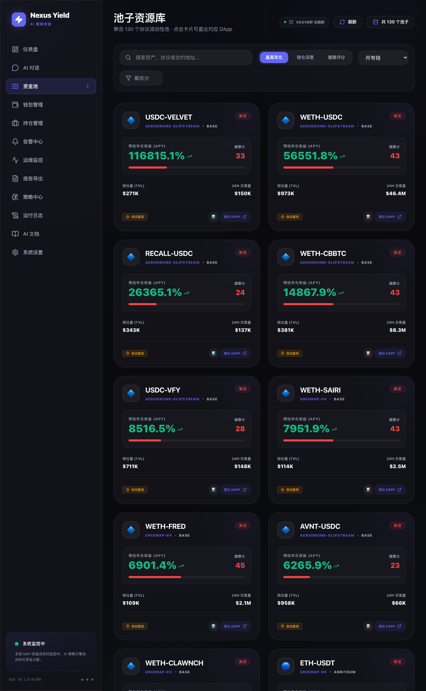
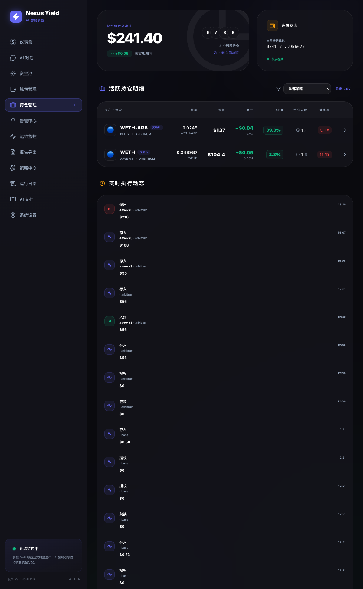

<div align="center">

# ProfitLayer

**AI-Driven Multi-Chain DeFi Yield Optimization System**

[](LICENSE)
[](https://nodejs.org/)
[](https://python.org/)
[](https://typescriptlang.org/)

[English](./README.md) · [简体中文](./README.zh-CN.md) · [Quick Start](./docs/快速开始.md) · [API Docs](./docs/API.md) · [Architecture](./docs/ARCHITECTURE.md)

</div>

---

ProfitLayer scans 200+ DeFi protocols across 10+ chains, uses AI models to score risk and optimize portfolio allocation, then executes strategies automatically — all managed through a professional-grade dashboard with 2FA security.

> **Status: Research Preview / Beta**
> This project is intended for research and educational purposes. It includes a fully integrated risk control system, but real-fund deployment requires caution. Not financial advice.

## What Makes This Different

Most open-source DeFi tools solve one piece of the puzzle. ProfitLayer combines them into a working system:

| Capability | Hummingbot / Freqtrade | Yearn / Beefy | ProfitLayer |
|---|---|---|---|
| Multi-chain execution | CEX-focused | Single-chain vaults | 10+ chains (EVM + Aptos + Solana) |
| AI strategy engine | Rule-based | Fixed vault logic | ML risk scoring + portfolio optimization |
| Professional dashboard | CLI / basic UI | On-chain only | Full web UI + desktop app |
| Risk control system | Basic stop-loss | Protocol-level | Multi-layer (anomaly detection, kill switch, exposure limits) |
| Self-hosted | ✅ | ❌ (protocol) | ✅ |

## Screenshots

<div align="center">



</div>

## Architecture

```
┌─ Scanner ──────── DefiLlama API ──── TimescaleDB ─┐
│                                                     │
├─ AI Engine ─────── Yield Predictor ── BullMQ ──────┤
│   (Python/FastAPI)  Risk Scorer                     │
│                     Portfolio Optimizer              │
│                     Anomaly Detector                 │
│                                                     │
├─ Executor ──────── Protocol Adapters ── Chains ────┤
│   (TypeScript)      Uniswap V3, Aave V3            │
│                     Curve, Lido, Compound V3        │
│                     Thala (Aptos)                    │
│                     Raydium, Marinade (Solana)       │
│                                                     │
├─ Dashboard ─────── Next.js 16 Web UI ──────────────┤
│                     JWT + TOTP 2FA Auth              │
│                     Real-time monitoring             │
│                                                     │
└─ Desktop ──────── Electron App (Win/Mac) ──────────┘
```

## Quick Start

### One-Click Install (Recommended)

```bash
curl -fsSL https://raw.githubusercontent.com/w7wnwpfj26-art/profit-layer/main/install.sh | bash
```

That's it! Open http://localhost:3002 in your browser.

### Docker Compose (Production)

```bash
# Download and start
curl -O https://raw.githubusercontent.com/w7wnwpfj26-art/profit-layer/main/docker-compose.prod.yml
docker compose -f docker-compose.prod.yml up -d
```

Access Dashboard: http://localhost:3002

```bash
# Management commands
docker compose -f docker-compose.prod.yml logs -f      # View logs
docker compose -f docker-compose.prod.yml restart     # Restart
docker compose -f docker-compose.prod.yml down        # Stop
```

### Manual Installation

<details>
<summary>Click to expand manual setup steps</summary>

#### Prerequisites

- Node.js 20+, pnpm 9+
- Docker (for PostgreSQL/TimescaleDB + Redis)
- Python 3.11+ (for AI engine, optional)

#### Steps

```bash
# 1. Clone
git clone https://github.com/w7wnwpfj26-art/profit-layer.git
cd profit-layer
cp .env.example .env   # Edit with your keys

# 2. Start database
bash scripts/start-database.sh --all

# 3. Run dashboard
pnpm install
pnpm dashboard        # http://localhost:3002

# 4. (Optional) Start AI Engine
cd ai-engine
pip install -e .
uvicorn src.api.server:app --port 8000
```

</details>

See [Quick Start Guide](./docs/快速开始.md) for detailed instructions.

## Project Structure

```
profit-layer/
├── packages/
│   ├── common/          # Shared types, DB, Redis, config
│   ├── scanner/         # DefiLlama pool scanner
│   ├── adapters/        # Protocol adapters (Uniswap, Aave, Thala, etc.)
│   ├── executor/        # Multi-chain transaction execution
│   ├── dashboard/       # Next.js web dashboard
│   └── desktop/         # Electron desktop app
├── ai-engine/           # Python AI engine (FastAPI)
│   ├── src/models/      # Yield predictor, risk scorer, IL calculator
│   ├── src/strategies/  # Portfolio optimizer, yield farming, arb
│   └── src/risk/        # Exposure manager, anomaly detection
├── infra/               # Docker configs (PostgreSQL, Redis, Grafana)
├── docs/                # Documentation
└── docker-compose.yml   # Full service orchestration
```

## Supported Chains

| Chain | Type | Protocols |
|-------|------|-----------|
| Ethereum | EVM | Uniswap V3, Aave V3, Curve, Lido, Compound V3 |
| Arbitrum | EVM | Uniswap V3, Aave V3, Curve, Compound V3 |
| Polygon | EVM | Uniswap V3, Aave V3, Curve, Compound V3 |
| Base | EVM | Uniswap V3, Aave V3, Compound V3 |
| Optimism | EVM | Uniswap V3, Aave V3 |
| Avalanche | EVM | Aave V3 |
| BSC | EVM | via DefiLlama |
| Aptos | Move | Thala Finance |
| Solana | SVM | Raydium, Marinade Finance |

## Strategies

- **Yield Farming** — AI-optimized LP farming with Sharpe ratio allocation
- **Lending Arbitrage** — Interest rate differentials across lending protocols
- **Cross-DEX Arbitrage** — Price discrepancy detection across DEXs
- **Liquid Staking** — Automated staking through LST protocols
- **Auto-Compound** — Harvest and reinvest rewards automatically

## Safety & Security

- JWT authentication with Google Authenticator (TOTP) 2FA
- AES-256 encrypted key storage
- Transaction simulation before execution
- Per-transaction and daily spending limits
- Emergency kill switch (instant halt)
- Stop-loss and trailing stop monitoring
- Anomaly detection (rug pull, TVL crash)
- Full audit logging with Telegram alerts

## Tech Stack

| Layer | Technology |
|-------|-----------|
| Runtime | Node.js 20+, Python 3.11+ |
| Language | TypeScript 5, Python |
| Frontend | Next.js 16, React 19, TailwindCSS 4, Recharts |
| Desktop | Electron + electron-builder |
| Database | TimescaleDB (PostgreSQL + time-series) |
| Queue | Redis 7+ / BullMQ |
| Blockchain | viem, @aptos-labs/ts-sdk, @solana/web3.js |
| AI/ML | FastAPI, scikit-learn, pandas, numpy |
| Infra | Docker Compose, Grafana |
| Build | pnpm workspaces, Turbo |

## API Endpoints (AI Engine)

| Endpoint | Description |
|----------|-------------|
| `GET /health` | System health check |
| `POST /risk/assess` | Pool risk assessment |
| `POST /risk/il-calculate` | Impermanent loss calculation |
| `POST /strategy/optimize` | Portfolio optimization |
| `POST /strategy/analyze` | Strategy signal generation |
| `GET /exposure` | Current exposure report |

## Contributing

Contributions are welcome! Please open an issue or submit a PR.

## License

[MIT](./LICENSE) — Copyright (c) 2026 Wang Qi

## Disclaimer

This project involves automated DeFi strategies and is provided for **research and educational purposes only**. It does not constitute investment advice. Users assume all risks associated with DeFi interactions. Always start with dry-run mode and small amounts.

---

<div align="center">

**[Documentation](./docs/)** · **[Report Bug](https://github.com/w7wnwpfj26-art/profit-layer/issues)**

</div>
